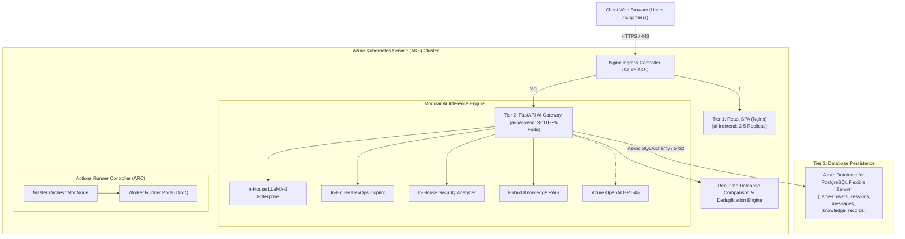

# Enterprise 3-Tier AI Application with Modular Model Gateway, Azure AKS & PostgreSQL

[](https://azure.microsoft.com)
[](file:///Users/rajnadar/Desktop/April-End-End-Project/FE)
[](file:///Users/rajnadar/Desktop/April-End-End-Project/BE)
[](file:///Users/rajnadar/Desktop/April-End-End-Project/BE/app/database.py)
[](file:///Users/rajnadar/Desktop/April-End-End-Project/runner-node-master-node/k8s)
[](file:///Users/rajnadar/Desktop/April-End-End-Project/.github/workflows)

## 📌 Executive Overview
This end-to-end enterprise solution delivers a robust **Three-Tier Architecture** for AI-driven assistance, modular model routing, and database comparison:
- **Tier 1 (Frontend - `FE/`)**: High-end React SPA with real-time chatbot interface, active model selector, multi-user team switcher, dedicated database comparison tool, and live cluster telemetry.
- **Tier 2 (Backend - `BE/`)**: Asynchronous FastAPI microservice with a modular AI inference gateway (in-house LLaMA-3, DevOps Copilot, Security Analyzer, RAG Synthesizer, Azure OpenAI GPT-4o) and automated real-time database comparison.
- **Tier 3 (Database Layer - `Azure PostgreSQL / RDS`)**: Persistent state management storing conversations, prompt-response records, token latencies, and knowledge base vectors accessible across all team accounts.
- **DevOps & Infrastructure (`runner-node-master-node/`)**: GitHub Actions CI/CD pipelines, Master-Node / Runner-Node setup scripts, production Azure AKS manifests, Helm 3 charts, and Terraform IaC.

---

## 🏛️ System Architecture Topology



---

## 📂 Repository Structure

| Folder | Purpose | Highlights |
| :--- | :--- | :--- |
| **[FE/](file:///Users/rajnadar/Desktop/April-End-End-Project/FE)** | React Chatbot Frontend | Glassmorphism UI, real-time message stream, Model Selector, DB Comparison UI, Multi-User switcher |
| **[BE/](file:///Users/rajnadar/Desktop/April-End-End-Project/BE)** | FastAPI AI Model Gateway | Modular model router, real-time DB deduplication/comparison, async SQLAlchemy ORM, health/ready probes |
| **[runner-node-master-node/](file:///Users/rajnadar/Desktop/April-End-End-Project/runner-node-master-node)** | Master-Node, Runner & IaC | Master & Runner setup scripts, Docker-in-Docker runners, K8s manifests, Helm charts, Terraform IaC |
| **[.github/workflows/](file:///Users/rajnadar/Desktop/April-End-End-Project/.github/workflows)** | CI/CD Automation | End-to-end build, test, container push to ACR, and deployment to Azure AKS |

---

## ⚡ Quick Start & Deployment Guide

### Option 1: Run Full 3-Tier Stack Locally via Docker Compose
```bash
# From workspace root:
docker compose up --build -d
```
Access endpoints:
- **Frontend Chatbot UI**: `http://localhost:3000`
- **Backend API & Swagger Docs**: `http://localhost:8000/api/v1/docs`
- **PostgreSQL Database**: `localhost:5432` (`aidatabase` / `dbadmin`)
- **Readiness Probe**: `http://localhost:8000/api/v1/health/ready`

---

### Option 2: Deploy to Azure AKS with Helm Chart
```bash
# 1. Connect to your AKS cluster
az aks get-credentials --resource-group rg-enterprise-ai-aks --name aks-enterprise-ai-cluster

# 2. Deploy Helm Chart
helm upgrade --install ai-enterprise-stack ./runner-node-master-node/helm/ai-app-chart \
  --namespace production \
  --create-namespace
```

---

### Option 3: Provision Complete Azure Cloud Infrastructure with Terraform
```bash
cd runner-node-master-node/terraform
terraform init
terraform plan
terraform apply -auto-approve
```

---

### Option 4: Setup Self-Hosted CI/CD Master and Runner Nodes
```bash
# 1. On Master Node:
sudo ./runner-node-master-node/master-node/setup-master.sh
GITHUB_PAT='ghp_yourtoken' ./runner-node-master-node/master-node/generate-runner-token.sh <org> <repo>

# 2. On Worker Runner Nodes:
sudo ./runner-node-master-node/runner-node/setup-runner.sh https://github.com/<org>/<repo> <RUNNER_TOKEN>
```

---

## 🔍 Key Capabilities Demonstrated

1. **Modular Model Selection**: Switch dynamically between fine-tuned in-house modules and cloud foundation models.
2. **Database Persistence**: User conversations, messages, and model metadata are saved to Azure PostgreSQL.
3. **Multi-User History Retrieval**: Switching users in the UI instantly fetches that user's historical sessions and records from the database.
4. **Data Comparison Engine**: When new prompts or architecture specs are submitted, the backend indexes and compares them against historical database records, computing similarity percentages, diffs, and AI recommendations.
5. **DevOps Automation**: Complete production Kubernetes manifests, HPA autoscaling, Helm charts, self-hosted runner orchestration, and multi-stage CI/CD pipelines.
